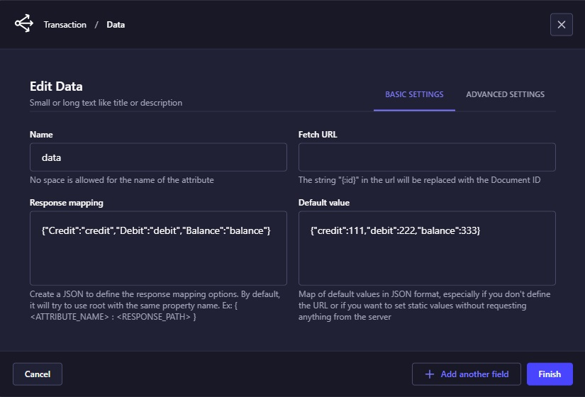
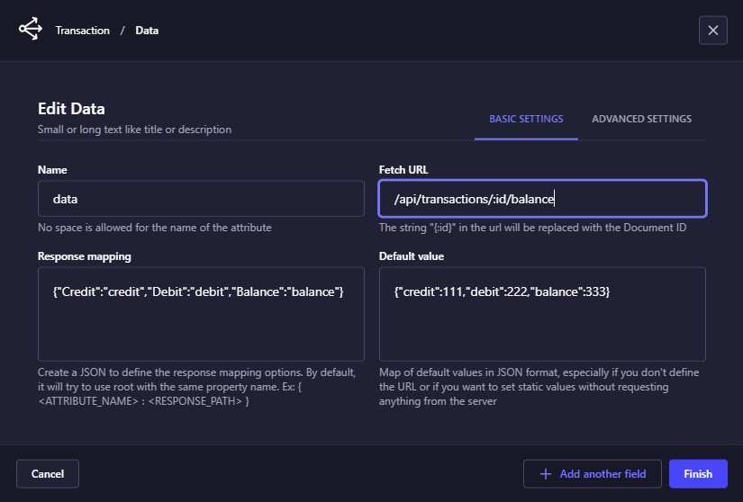
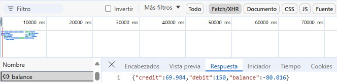

# VirtVal Plugin
Strapi plugin to add a field with a virtual or external value to an existing Content-Type.


## Response mapping

The "response mapping" options are defined in JSON format, such as:

```json
{
    "Credit":"credit",
    "Debit":"debit",
    "Balance":"balance"
}
```
In this format, the key represents the name or label of the component, while the value represents the attribute or path in the server response or the JSON defined in the "Default value" property. This property simulates a server response in case the request URL is not specified. For example, the default value could be:

```json
{
    "credit":111,
    "debit":222,
    "balance":333
}
```
When the server response is more complex, the path is represented as a sequence of attributes separated by periods. For instance, consider the following server response:

```json
{
  "data": {
    "src": {
      "credit": 111,
      "debit": 222,
      "balance": 333
    },
    "rsc": [1, 2, 3]
  },
  "total": 2
}
```
In this case, the "response mapping" should be defined as follows:

```json
{
  "Credit": "data.src.credit",
  "Debit": "data.src.debit",
  "Balance": "data.src.balance"
}
```
This structure allows the system to correctly map and display the values from the server response to the corresponding visual components. By using this approach, developers can ensure that the data is accurately represented in the user interface, even when dealing with nested and complex JSON structures.

## Rendering multiple static values

The rendering of multiple static values involves defining static values for various attributes that will be represented as visual components. This allows for the predefined values to be visualized in a user interface. By setting these static values, developers can ensure that specific attributes are consistently displayed in a predetermined manner, facilitating a consistent and predictable user experience. This approach is particularly useful for displaying information that does not change frequently, such as labels, placeholders, or default text in forms and other UI elements.



As result:


## Fetching multiple remote values

Fetching multiple remote values involves displaying multiple values similar to *Rendering multiple static values* with the key difference being that the data is obtained from a request to a server. This server could be a plugin or controller within Strapi, where there is no need to specify the HTTPS protocol or the server's DNS. For example, the route could be `/api/transactions/:id/balance` where `transaction` is the Content-Type. Alternatively, it could be a call to an external server, such as `https://dummyjson.com/products`.

When specifying a dynamic route like `/api/transactions/:id/balance`, the :id placeholder is replaced by the document ID of the currently open collection type. This allows the search process to be customized based on the specific document being viewed. For instance, if you are viewing a transaction with ID `w29184yrkpzqaa7ahbzi65vg`, the route would automatically become `/api/transactions/w29184yrkpzqaa7ahbzi65vg/balance`, ensuring that the correct balance information is fetched for that specific transaction.



In such case we should receive the following server response answer:



As a result, the Frontend interface should look like this:


**Key Points:**
1. Dynamic Data Retrieval:
    - Data is fetched dynamically from a server, either a Strapi *plugin/controller* or an external API.
    - Example: `/api/transactions/:id/balance` or `https://dummyjson.com/products`.
2. No Need for Protocol or DNS:
    - When using Strapi, there is no need to specify the HTTPS protocol or the server's DNS, as Strapi handles these internally.
3. Dynamic Route Customization:
    - The `:id` placeholder in routes like `/api/transactions/:id/balance` is automatically replaced by the document ID of the currently open collection type.
    - This customization ensures that the correct data is fetched for the specific document being viewed.

**Example:**
Suppose you have a collection type for transactions, and you want to display the balance for a specific transaction. The dynamic route `/api/transactions/:id/balance` would work as follows:

1. Dynamic Route: `/api/transactions/:id/balance`
2. Replacement of `:id`: If the current transaction has an ID of `w29184yrkpzqaa7ahbzi65vg`, the route becomes `/api/transactions/w29184yrkpzqaa7ahbzi65vg/balance`.
3. Fetching Data: The system makes a request to `/api/transactions/w29184yrkpzqaa7ahbzi65vg/balance` to fetch the balance information for the transaction with ID `w29184yrkpzqaa7ahbzi65vg`.

This approach allows for a highly customizable and dynamic data retrieval process, ensuring that the correct information is displayed based on the specific context of the document being viewed.


## Similar Plugin
- [Remote select: allow selecting one or several values from the remote options endpoint.](https://github.com/dmitriy-nz/strapi-plugin-remote-select/tree/main)

## References
- [Plugin Development](./doc/Develop.md)