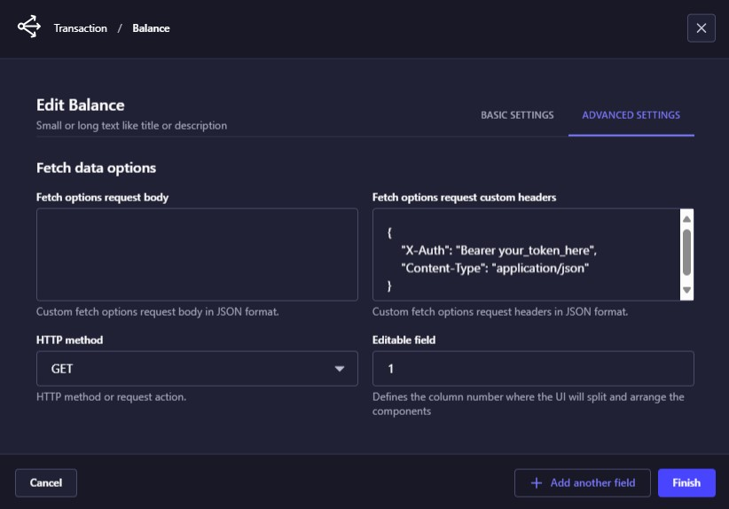

# VirtVal Plugin
Strapi plugin to add a field with a virtual or external value to an existing Content-Type.

🎉 Supports Strapi version 5 🎉

**Main Topics:**
- Install & Configure
- Rendering a static value 
- Rendering a remote value 
- Response mapping
- Rendering multiple static values
- Fetching multiple remote values
- Advanced Settings 
- Similar Plugin

## Install & Configure
To install and configure the VirtVal plugin for Strapi, follow these steps:
1. Open your terminal and navigate to your Strapi project directory.
2. Run the following command to install the virtval plugin:
    ```sh
    npm install virtval
    ```
3. Update the Plugin Configuration File:
    - Navigate to the `config\plugins.ts` file in your Strapi project.
    - Add the following code to configure the virtval plugin:
        ```ts
        const { PLUGIN_VIRTVAL = false } = process.env;

        const plugins = {};

        if (PLUGIN_VIRTVAL) {
            plugins["virtval"] = { enabled: true };
        }
        export default () => (plugins);
        ```
    - Explanation: 
        - The PLUGIN_VIRTVAL environment variable is used to determine whether the virtval plugin should be enabled. If this variable is set to true, the plugin will be enabled.
        - The plugins object is used to configure Strapi plugins.
        - If PLUGIN_VIRTVAL is true, the virtval plugin is added to the plugins object with the enabled property set to true.
    - To enable the virtval plugin, you need to set the PLUGIN_VIRTVAL environment variable to true. This can be done in your `.env` file or directly in your environment.
        ```sh
        PLUGIN_VIRTVAL=true
        ```
    - Once the environment variable is set and the server is restarted, the virtval plugin will be enabled and ready to use.

By following these steps, you can successfully install and configure the virtval plugin in your Strapi project, allowing you to take advantage of its features for rendering and managing values dynamically.        

## Rendering a static value 

Rendering a static value allows you to create a component that visualizes a fictitious value that does not belong to a **Content-Type**. The `"Default value"` property enables you to define the value that will be displayed on the screen, and the `"Name"` property specifies the name of the field. This approach is useful for displaying constant or placeholder information that does not change based on the content of a `Content-Type`, such as labels, headers, or static text.


As a result in the frontend section:


## Rendering a remote value 

When rendering values from a server response, if the field name in your component matches a property in the server response, there is no need to specify the **"Response Mapping"**. For example, if you have a field named "balance" and the server response is `{ "balance": "-6.35" }`, the system will automatically map the "balance" field to the corresponding value in the response.


In such case we should receive the following server response answer:


As a result in the frontend section:


However, if the server response uses a different property name, such as `{ "total_balance": "-6.35" }`, you will need to specify the response mapping to ensure the correct value is displayed. In this case, you would define the mapping as `{"balance": "total_balance"}` to map the "balance" field in your component to the "total_balance" property in the server response.

**Key Points:**
1. Automatic Mapping:
    - If the field name in your component matches a property in the server response, no response mapping is needed.
    - Example: Field "balance" matches server response `{ "balance": "-6.35" }`.
2. Manual Mapping:
    - If the server response uses a different property name, you must specify the response mapping.
    - Example: Field "balance" needs to map to server response `{ "total_balance": "-6.35" }`.
    - Mapping: `{"balance": "total_balance"}`.

By specifying the response mapping when necessary, you ensure that the correct data is displayed in your component, even if the server response uses different property names.

## Response mapping

The "response mapping" options are defined in JSON format, such as:

```json
{
    "Credit":"credit",
    "Debit":"debit",
    "Balance":"balance"
}
```
In this format, the key represents the name or label of the component, while the value represents the attribute or path in the server response or the JSON defined in the "Default value" property. This property simulates a server response in case the request URL is not specified. For example, the default value could be:

```json
{
    "credit":111,
    "debit":222,
    "balance":333
}
```
When the server response is more complex, the path is represented as a sequence of attributes separated by periods. For instance, consider the following server response:

```json
{
  "data": {
    "src": {
      "credit": 111,
      "debit": 222,
      "balance": 333
    },
    "rsc": [1, 2, 3]
  },
  "total": 2
}
```
In this case, the "response mapping" should be defined as follows:

```json
{
  "Credit": "data.src.credit",
  "Debit": "data.src.debit",
  "Balance": "data.src.balance"
}
```
This structure allows the system to correctly map and display the values from the server response to the corresponding visual components. By using this approach, developers can ensure that the data is accurately represented in the user interface, even when dealing with nested and complex JSON structures.

## Rendering multiple static values

This component allows you to create multiple components to take advantage of a single server request for performance reasons. By doing this, you can include all the values in the frontend and dynamically create a list of components along with their respective values. In this case, it is necessary to specify the **Response Mapping** to ensure that each component correctly displays the corresponding value from the server response.

The rendering of multiple static values involves defining static values for various attributes that will be represented as visual components. This allows for the predefined values to be visualized in a user interface. By setting these static values, developers can ensure that specific attributes are consistently displayed in a predetermined manner, facilitating a consistent and predictable user experience. This approach is particularly useful for displaying information that does not change frequently, such as labels, placeholders, or default text in forms and other UI elements.


As a result in the frontend section:


## Fetching multiple remote values

Fetching multiple remote values involves displaying multiple values similar to *Rendering multiple static values* with the key difference being that the data is obtained from a request to a server. This server could be a plugin or controller within Strapi, where there is no need to specify the HTTPS protocol or the server's DNS. For example, the route could be `/api/transactions/:id/balance` where `transaction` is the Content-Type. Alternatively, it could be a call to an external server, such as `https://dummyjson.com/products`.

When specifying a dynamic route like `/api/transactions/:id/balance`, the :id placeholder is replaced by the document ID of the currently open collection type. This allows the search process to be customized based on the specific document being viewed. For instance, if you are viewing a transaction with ID `w29184yrkpzqaa7ahbzi65vg`, the route would automatically become `/api/transactions/w29184yrkpzqaa7ahbzi65vg/balance`, ensuring that the correct balance information is fetched for that specific transaction.


In such case we should receive the following server response answer:


As a result, the Frontend interface should look like this:


**Key Points:**
1. Dynamic Data Retrieval:
    - Data is fetched dynamically from a server, either a Strapi *plugin/controller* or an external API.
    - Example: `/api/transactions/:id/balance` or `https://dummyjson.com/products`.
2. No Need for Protocol or DNS:
    - When using Strapi, there is no need to specify the HTTPS protocol or the server's DNS, as Strapi handles these internally.
3. Dynamic Route Customization:
    - The `:id` placeholder in routes like `/api/transactions/:id/balance` is automatically replaced by the document ID of the currently open collection type.
    - This customization ensures that the correct data is fetched for the specific document being viewed.

**Example:**
Suppose you have a collection type for transactions, and you want to display the balance for a specific transaction. The dynamic route `/api/transactions/:id/balance` would work as follows:

1. Dynamic Route: `/api/transactions/:id/balance`
2. Replacement of `:id`: If the current transaction has an ID of `w29184yrkpzqaa7ahbzi65vg`, the route becomes `/api/transactions/w29184yrkpzqaa7ahbzi65vg/balance`.
3. Fetching Data: The system makes a request to `/api/transactions/w29184yrkpzqaa7ahbzi65vg/balance` to fetch the balance information for the transaction with ID `w29184yrkpzqaa7ahbzi65vg`.

Note that in the case of array or list type structures, they can be accessed through their numeric index as if it were another property. See the following example:


Based on the following server response: 
```json
{
    "products": [
        {
            "id": 1,
            "title": "Essence Mascara Lash Princess",
            "reviews": [
                {
                    "rating": 2,
                    "reviewerName": "John Doe"
                },
                {
                    "rating": 2,
                    "reviewerName": "Nolan Gonzalez"
                },
            ],
        }
    ]
}
```
As a result in the frontend section:


This approach allows for a highly customizable and dynamic data retrieval process, ensuring that the correct information is displayed based on the specific context of the document being viewed.

## Advanced Settings 
Additionally, in the advanced settings section, you can specify extra options related to the body of the request, provided that the HTTP action or method is not GET. This includes defining the necessary parameters and data to be sent in the request body, which is essential for actions like POST, PUT. These details must be specified in JSON format to ensure proper structure and compatibility.



Furthermore, you can also define the options for the request headers in the same advanced settings section. Headers are crucial for providing additional information about the request, such as authentication tokens, content type, and other metadata. Like the request body, the headers must also be specified in JSON format to maintain consistency and clarity.

**Key Points:**
1. Request Body Options:
    - Available for HTTP actions other than GET.
    - Must be specified in JSON format.
    - Includes parameters and data to be sent in the request body.
    - Example:
        ```json
        {
            "name": "John Doe",
            "email": "john.doe@example.com",
            "password": "securepassword"
        }
        ```

2. Request Headers Options:
    - Defined in the advanced settings section.
    - Must be specified in JSON format.
    - Includes authentication tokens, content type, and other metadata.
    - Example:
        ```json
        {
            "Authorization": "Bearer your_token_here",
            "Content-Type": "application/json"
        }
        ```

By specifying these options in JSON format, you ensure that the request is structured correctly and that all necessary information is included, making the integration with the server more robust and reliable.

## Similar Plugin
- [Remote select: allow selecting one or several values from the remote options endpoint.](https://github.com/dmitriy-nz/strapi-plugin-remote-select/tree/main)

## References
- [Plugin Development](./doc/Develop.md)